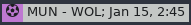

# Polybar - Premier League Fixtures

A polybar display with your favorite PL team's next fixture.




### Usage:
1. Update the shebang to point to your venv.
2. Change the team name :(
3. Update and add the following to your polybar config:

```
[module/football-fixtures]
type = custom/script

interval = 86400
format-background = ${colors.background}
format-foreground = ${colors.foreground}  
exec = "PATH/TO/football_fixtures.py"
click-middle = "PATH/TO/status.py"
```
